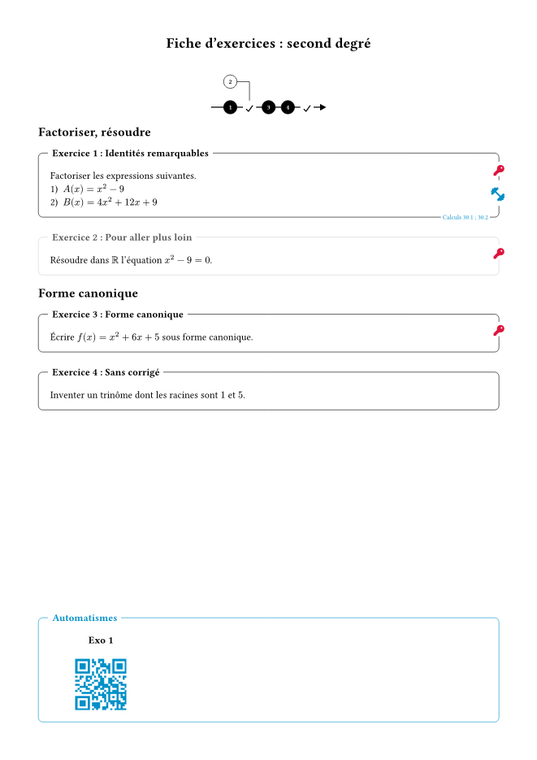
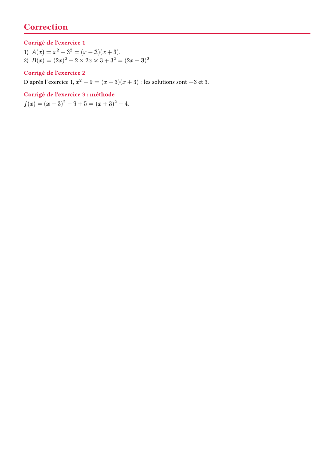

# template-exercices

Fiches d'exercices à la manière du package LaTeX
[ProfMaquette](https://ctan.org/pkg/profmaquette) de **Christophe Poulain** :
exercices numérotés, obligatoires ou facultatifs, feuille de route, entraînement
en ligne par QR code, et corrigés que l'on affiche — ou non — d'un seul réglage.

> [!NOTE]
> template-exercices reprend seulement une petite partie des idées de ProfMaquette, dont il
> s'inspire directement. Ses fonctionnalités sont **beaucoup plus limitées** que
> celles de l'original, qui reste la référence. Ce paquet a d'abord été écrit pour
> mon **usage personnel**. Il est partagé tel quel et **pourra évoluer**, y compris
> de façon incompatible entre deux versions `0.x`.

*Build exercise sheets (in French) inspired by Christophe Poulain's LaTeX package
ProfMaquette: numbered exercises, optional ones in gray, a road map of the
exercises, online training via QR codes, and solutions shown after each exercise, at the end, or not at all — all
from a single setting, including which solutions to show (`"1-6,9,12"`).
It covers only a small part of ProfMaquette's features. It was first written for
personal use and may change in future versions.*

<p align="center">
  
  
</p>

## Prérequis : polices Font Awesome

La clé et l'haltère sont des icônes [Font Awesome](https://fontawesome.com/download),
dessinées par le paquet [fontawesome](https://typst.app/universe/package/fontawesome) :
il faut installer sur l'ordinateur les polices « Font Awesome Free » (version
*desktop*, fichiers `.otf`). Sur la web app Typst, déposer ces fichiers `.otf`
dans le projet.

## Démarrage rapide

```typ
#import "@preview/template-exercices:0.1.0": maquette, exercice, solution, afficher-fdr, thematique

#maquette(afficher-corrige: "fin")[
  #afficher-fdr

  #thematique[Factoriser]
  #exercice(titre: "Identités remarquables", entrainement: "https://exemple.fr")[
    Factoriser $x^2 - 9$.
  ]
  #solution[
    $x^2 - 9 = (x - 3)(x + 3)$.
  ]

  #thematique[Résoudre]
  #exercice(titre: "Pour aller plus loin", obligatoire: false)[
    Résoudre $x^2 - 9 = 0$.
  ]
  #solution[
    Les solutions sont $-3$ et $3$.
  ]
]
```

Un exemple complet se trouve dans [`examples/exemple.typ`](examples/exemple.typ).

## `maquette` : régler toute la fiche

`maquette` englobe la fiche et regroupe tous les réglages. Elle ajoute
automatiquement, à la fin, le bloc **Automatismes** (QR codes) puis la
**Correction**.

```typ
#maquette(afficher-corrige: "apres", corriges: "1-6,9,12")[ … ]
// ou, sans crochets autour de toute la fiche :
#show: maquette.with(afficher-corrige: "apres", corriges: "1-6,9,12")
```

| Paramètre | Défaut | Rôle |
|---|---|---|
| `afficher-corrige` | `"fin"` | `none` : aucun corrigé ; `"apres"` : sous chaque énoncé ; `"fin"` : en fin de fiche |
| `corriges` | `auto` | corrigés affichés : `auto` (tous), `4`, `"1-6,9,12"`, `(1, "3-5")`, `"obligatoires"`, `"facultatifs"`. Les énoncés sont toujours tous affichés. |
| `vers-solution` | `true` | clé cliquable sur l'exercice, menant au corrigé (et retour) |
| `bleu-perso` | `rgb("#0090C8")` | couleur des liens vers l'extérieur : haltère, QR codes, source |
| `rouge-perso` | `rgb("#DC143C")` | couleur de navigation : clé, titres des corrigés |
| `couleur-sol` | `auto` | couleur des titres de corrigés (`auto` = `rouge-perso`) |
| `titre-corrige` | `auto` | début du titre de chaque corrigé (`auto` = « Corrigé de l'exercice », ou sa traduction) |
| `colonnes-corriges` | `1` | nombre de colonnes de la Correction |
| `correction-nouvelle-page` | `true` | la Correction commence sur une nouvelle page ; `false` : elle suit la fiche (indispensable pour une maquette dans `columns(…)` ou dans un cadre) |
| `couleur-obligatoire` | `auto` | couleur des exercices obligatoires (`auto` = noir) |
| `style-exercice` | `"fond-blanc"` | style des cadres d'exercice et du bloc Automatismes : `"fond-blanc"` (titre sans cadre, qui coupe le filet), `"etiquette-encadree"` (titre dans un petit cadre, à cheval sur le filet), `"bandeau"` (titre en haut du cadre, séparé de l'énoncé par un filet), `"etiquette-pleine"` (étiquette remplie de couleur, titre en blanc) |
| `colonnes-automatismes` | `3` | nombre de QR codes par ligne |
| `taille-qr` | `2cm` | côté des QR codes (agrandi automatiquement si l'URL est trop longue pour rester lisible) |
| `couleur-fdr` | `black` | couleur de la feuille de route |
| `langue` | `auto` | langue des mots du paquet : `"fr"`, `"en"`, `"de"`, `"es"`, `"it"`. `auto` suit la langue du document, sauf l'anglais (langue par défaut de Typst) qui donne le français : écrire `langue: "en"` pour l'anglais |

Les couleurs acceptent n'importe quelle couleur Typst : `blue`, `rgb("#1E90FF")`,
`green.darken(20%)`…

## `exercice` : un énoncé

```typ
#exercice(titre: "Titre", entrainement: "https://…", source: "Calculs 30.1")[
  Énoncé…
]
```

Les exercices sont numérotés automatiquement.

| Paramètre | Défaut | Rôle |
|---|---|---|
| `titre` | `none` | affiché après « Exercice N : » |
| `entrainement` | `none` | URL d'un entraînement en ligne : haltère cliquable sur le filet droit, QR code dans le bloc Automatismes |
| `source` | `none` | petit texte sur le filet bas (ex. les exercices à faire dans la ressource) |
| `obligatoire` | `true` | `false` : exercice facultatif, en gris |
| `pas-corrige` | `false` | `true` : jamais de corrigé pour cet exercice |
| `titre-solution` | `none` | complément du titre du corrigé (« Corrigé de l'exercice 3 : méthode ») |
| `stop` | `false` | `true` : coche supplémentaire après cet exercice, sur la feuille de route (rarement utile : `thematique` en place déjà) |

## `afficher-fdr` : la feuille de route

`#afficher-fdr` dessine le schéma de la feuille de route, comme `\AfficheFdR` dans
ProfMaquette. On le place dans la maquette, en général avant le premier exercice
(`#align(center, afficher-fdr)` pour le centrer). C'est un contenu, pas une
fonction : on l'écrit **sans parenthèses**.

- Les exercices obligatoires forment la route du bas (disques noirs), qui se
  termine par une flèche.
- **Les thématiques placent les coches** : chaque `#thematique[…]` ferme la
  thématique précédente, et une coche suit son dernier exercice. Une coche
  finale termine toujours la route. Une thématique placée avant le premier
  exercice ne place pas de coche. L'élève fait les exercices de la route jusqu'à
  la coche, puis demande la validation.
- Les exercices facultatifs d'une thématique sont sur la ligne du haut (disques
  blancs), qui rejoint la route à la coche : l'enseignant peut les proposer
  avant que l'élève poursuive.
- Chaque disque est un lien vers son exercice.

```typ
#maquette[
  #align(center, afficher-fdr)
  #thematique[Calculer avec les suites]
  #exercice[…]
  #exercice(obligatoire: false)[…]
  #thematique[Monotonie]         // coche avant cette thématique
  #exercice[…]
]                                // coche finale
```

On peut aussi ajouter une coche à la main avec `exercice(stop: true)`.

Le schéma ne montre que les exercices de la maquette qui le contient (ou
jusqu'au prochain `reinitialiser-compteur-exercice()`).

## `thematique` : titre d'une thématique

```typ
#thematique[Calculer avec les suites]
#thematique(alignement: center)[I - Identités remarquables]
```

Titre en gras, 14 pt (plus grand si le texte dépasse 11 pt), jamais numéroté, aligné à gauche par défaut
(`alignement: center` ou `right` sinon). Ce n'est pas un titre Typst
(`heading`) : il ne dépend pas des réglages de titres du document (numérotation,
`show heading`…) et n'apparaît pas dans la table des matières. Les titres
ordinaires (`=`, `==`…) n'ont, eux, aucun effet sur la feuille de route.

## `solution` : le corrigé de l'exercice qui précède

```typ
#solution[ Corrigé… ]
```

Il est placé selon `afficher-corrige`, et ignoré s'il ne fait pas partie de la
sélection `corriges`. Le corrigé peut venir d'un autre fichier :

```typ
#import "corriges/exo-01.typ" as exo01   // ce fichier définit `#let corrige = [...]`
#solution(exo01.corrige)
```

## Sans `maquette`

Chaque réglage existe aussi séparément, à appeler avant le premier exercice :

- `reglages-couleurs(bleu-perso: …, rouge-perso: …)` ;
- `reglages-corriges(mode: …, vers-solution: …, couleur-sol: …, titre-corrige: …, colonnes: …, nouvelle-page: …)`,
  où `mode` vaut `none`, `"apres"` ou `"fin"` ;
- `couleur-exercices-obligatoires(couleur)` ;
- `style-exercices(style)`, avec les mêmes valeurs que `style-exercice`.

Il faut alors appeler soi-même, en fin de fiche et dans cet ordre,
`liste-entrainements(colonnes: …, taille-qr: …)` puis `liste-corriges()`.

Une maquette ne peut pas en contenir une autre : pour plusieurs fiches dans un
même document, placer les maquettes l'une après l'autre.

`reinitialiser-compteur-exercice()` repart de l'exercice 1 (plusieurs fiches dans
un même document). Avec `maquette`, c'est inutile : chaque maquette repart de
l'exercice 1, avec ses propres entraînements et corrigés.

## Correspondance avec ProfMaquette

| ProfMaquette | template-exercices |
|---|---|
| environnement `Maquette` | `maquette` |
| clé `FdR`, `\AfficheFdR` | `afficher-fdr` |
| `Route` | `obligatoire: true` (défaut) |
| `Stop` | `#thematique[…]` (ou `stop: true`) |
| `AEntretenir`, zone Entrainement | `entrainement:`, bloc Automatismes |
| `Source` | `source:` |
| environnement `Solution` | `solution` |
| `CorrigeApres` / `CorrigeFin` | `afficher-corrige: "apres"` / `"fin"` |
| `VersSolution` | `vers-solution: true` |
| `PasCorrige` | `pas-corrige: true` |
| `TitreSolution`, `TitreCorrige` | `titre-solution:`, `titre-corrige:` |
| `CouleurSol`, `Colonnes` | `couleur-sol:`, `colonnes-corriges:` |

## Historique des versions

Les changements de chaque version sont listés dans [CHANGELOG.md](CHANGELOG.md). nouvelle modif pour m'eddntraîner.

## Remerciements

Un grand merci à **Christophe Poulain**, auteur du package LaTeX
[ProfMaquette](https://ctan.org/pkg/profmaquette). template-exercices en
reprend la logique (exercices, feuille de route, entraînements, corrigés) et une partie du vocabulaire. Les idées sont
les siennes, et les limites de cette adaptation sont les miennes. Pour un outil
complet, utilisez ProfMaquette.

template-exercices utilise les paquets
[tiaoma](https://typst.app/universe/package/tiaoma) et
[fontawesome](https://typst.app/universe/package/fontawesome).

## Licence

LaTeX Project Public License (LPPL), version 1.3c ou toute version ultérieure —
voir [LICENSE](LICENSE). C'est la licence de ProfMaquette, dont ce paquet reprend
les idées.

```
Copyright 2026 Arthur Meyer

This work may be distributed and/or modified under the
conditions of the LaTeX Project Public License, either version 1.3c
of this license or (at your option) any later version.
The latest version of this license is in
  https://www.latex-project.org/lppl.txt
and version 1.3c or later is part of all distributions of LaTeX
version 2008 or later.

This work has the LPPL maintenance status `maintained'.
The Current Maintainer of this work is Arthur Meyer.

This work consists of the files src/lib.typ and src/exercices.typ.
```
